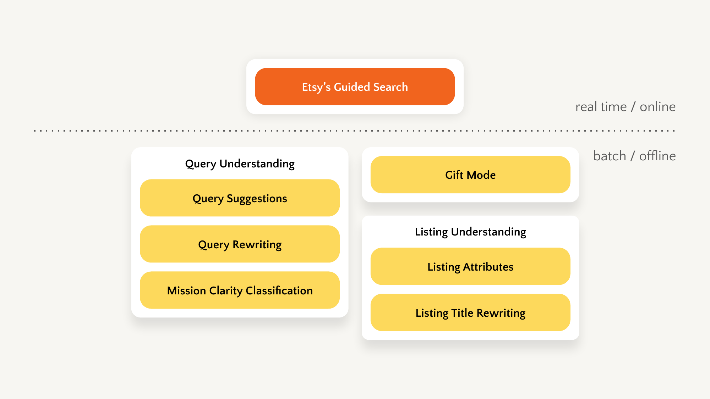
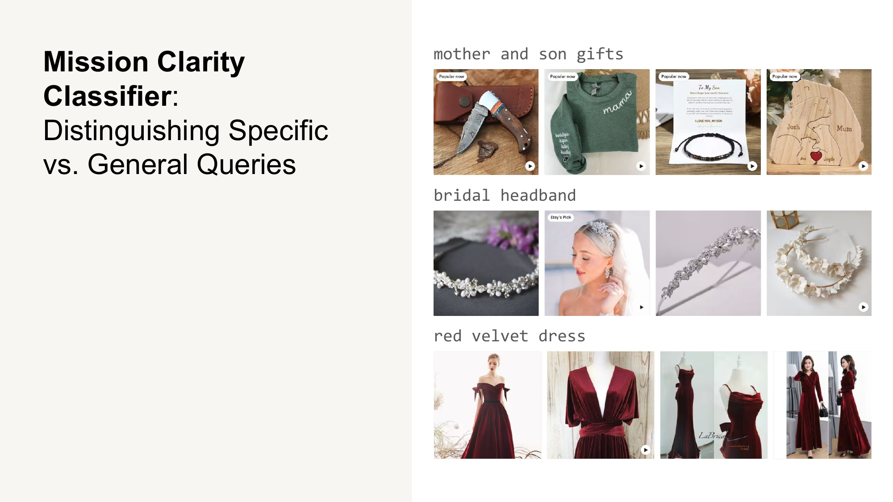

# LLMs at Etsy

How we used LLMs in production

---

## Etsy's Guided Search



---

## 8 LLM Use Cases at Etsy


---

## Mission Clarity Classifier



---

## v1 (45% accuracy)

```
As an experienced Etsy shopper, we are seeking your assistance to
evaluate the specificity of various shopping queries. Your role
involves assigning one of three possible clarity levels—high,
medium, or low—to each provided search query.

Here's how to interpret the clarity levels:

High Clarity: This category includes highly detailed and precise
search queries, such as "sterling silver hoop earrings",
"mid-century modern office decor", and "color pencil set".

Low Clarity: This group consists of broad and ambiguous search
queries, such as "gifts", "furniture", and "christmas".

Medium Clarity: Queries that are somewhat specific but not as
detailed as high clarity fall into this category, such as "sign",
"puzzle", "earrings", and "necklace".

To systematically approach this task, please follow these steps:
Step 1: Determine if the query explicitly identifies a particular
item or entity.
Step 2: In cases where the entity is not specified, categorize
the query as low clarity.
Step 3: For queries with a specified entity, evaluate if a
particular style or size is mentioned. Absence of such details
should result in a medium clarity classification, while their
presence warrants a high clarity label.

{{query}}
```

---

## v5 (90+% accuracy)

```
==Examples==
Query: Silver dog tag
Response:
{ "tangible_item": "dog tag", "item_descriptors":
  { material: ["silver"] }, "clarity_score": 2 }

Query: Mothers day gift
Response:
{ "gift_synonym": "gift", "occasion": "mothers day",
  "clarity_score": 0 }

Query: Father of the bride gift
Response:
{ "gift_synonym": "gift", "recipient": "Father of the bride",
  "clarity_score": 0 }

Query: Living room rug
Response:
{ "tangible_item": "rug", "recipient": "living room",
  "clarity_score": 1 }
```

> From 45% to 90+% accuracy through structured output and few-shot examples
