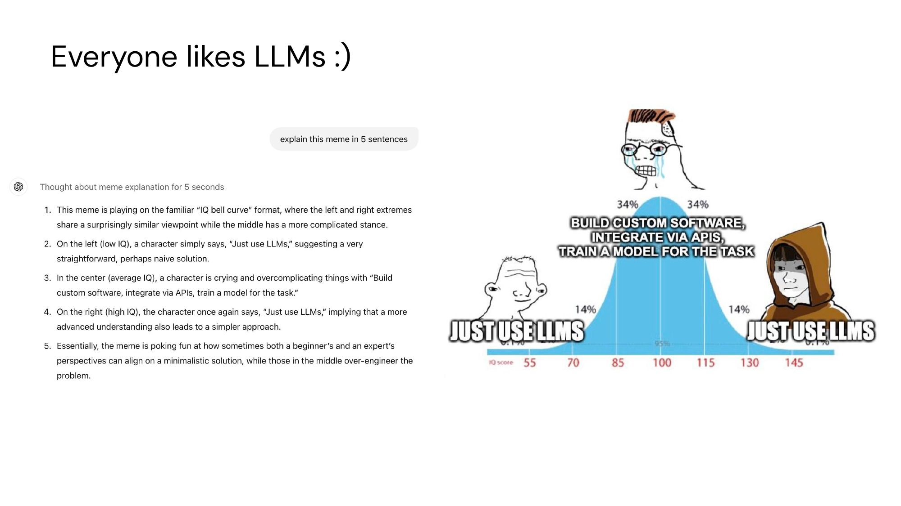
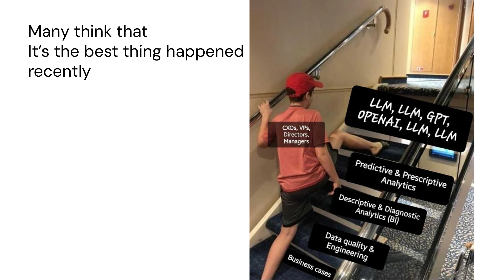

# What Are Large Language Models?

Brief History

---

## Everyone likes LLMs :)

---

## Many think that it's the best thing happened recently

---

## LLMs: Formal Definition

LLMs are AI models trained on vast amounts of text data to generate or analyze human-like language.

- **Deep learning models** trained on massive datasets using billions of parameters to understand and generate human-like text

- **Pretraining & Fine-Tuning** — They undergo two main training phases: pretraining on diverse text data to learn general language patterns and fine-tuning for specific tasks or improved alignment

- **Token-Based Processing** — They break down text into smaller units (tokens), predict the next token based on context, and generate responses by iterating this process

- **Emergent Abilities** — When scaled up, LLMs exhibit unexpected capabilities, like reasoning, summarization, and code generation, even without explicit programming

- **Limitations & Risks** — Despite their power, LLMs can generate hallucinations (false information), struggle with real-time updates, and require careful alignment to ethical considerations

---

## In Other Words

- **Big Brains** — LLMs are powerful AI that understand and generate text

- **Learn from the Internet** — They read tons of books, websites, and articles

- **Predict Words** — They guess the next word (or token) in a sentence, like smart autocomplete

- **Get Smarter Over Time** — More training makes them better at answering questions

- **Not Always Right** — They can still make mistakes, so double-check their answers!
