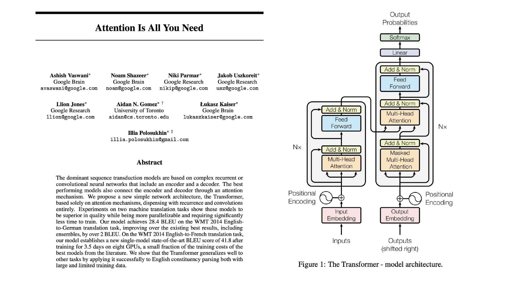
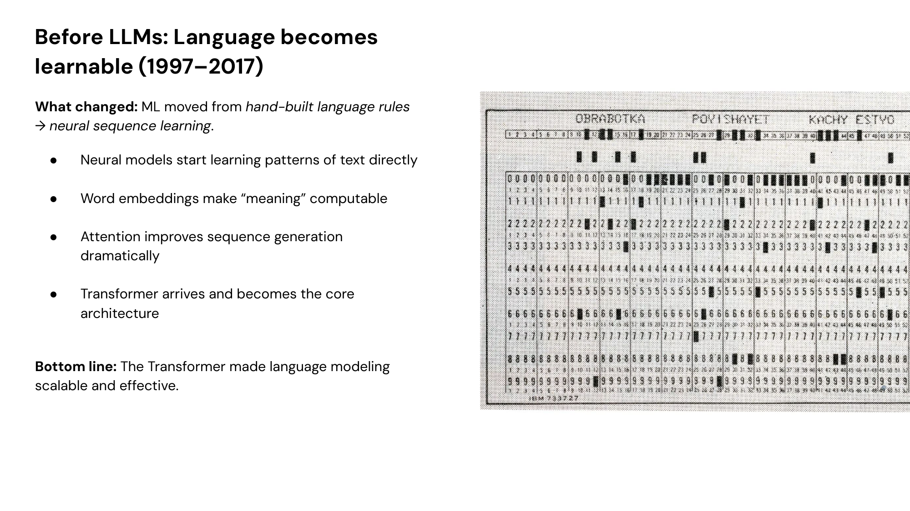
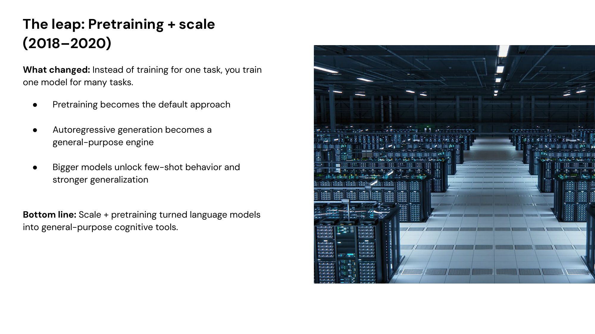
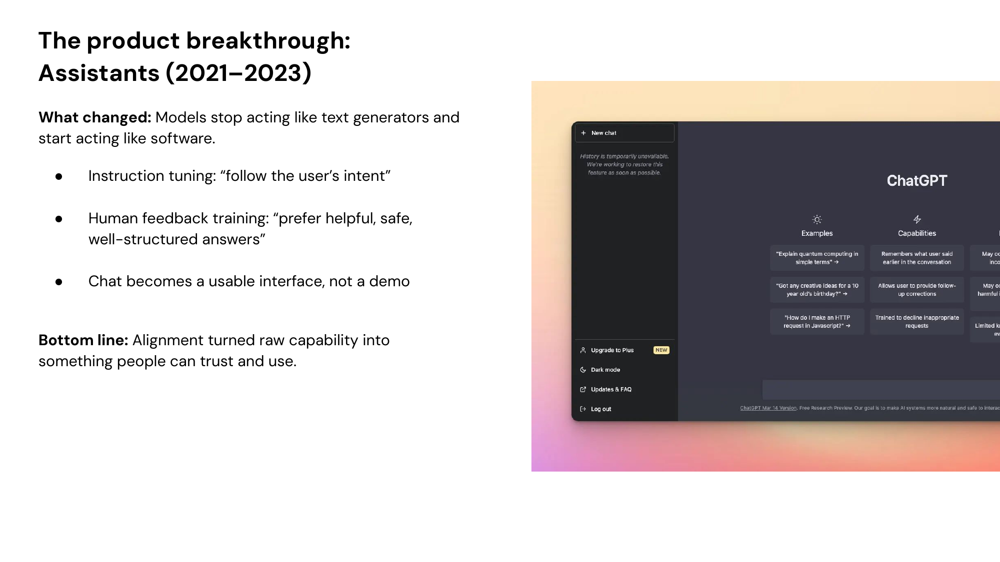
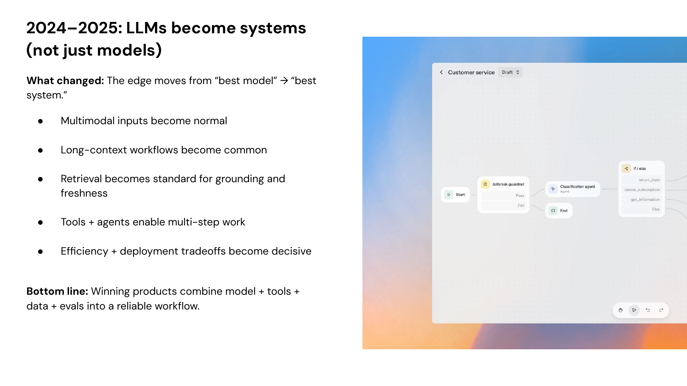
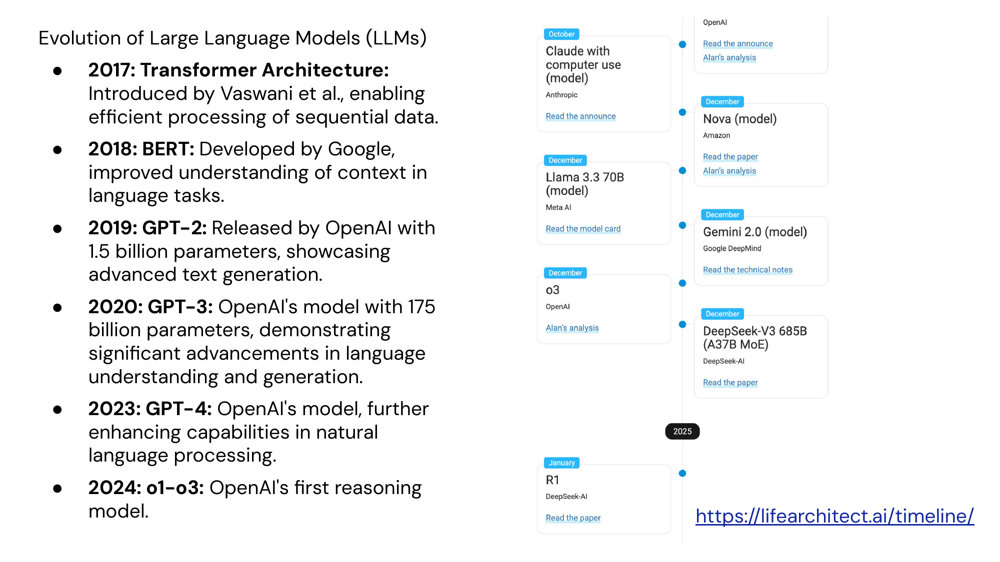

# Brief History of LLMs

Four eras of language AI

---

## The Transformer

---

## Era 1: Language Becomes Learnable (1997–2017)

**What changed:** ML moved from hand-built language rules → neural sequence learning.

- Neural models start learning patterns of text directly
- Word embeddings make "meaning" computable
- Attention improves sequence generation dramatically
- Transformer arrives and becomes the core architecture

> **Bottom line:** The Transformer made language modeling scalable and effective.

---

## Era 2: The Leap — Pretraining + Scale (2018–2020)

**What changed:** Instead of training for one task, you train one model for many tasks.

- Pretraining becomes the default approach
- Autoregressive generation becomes a general-purpose engine
- Bigger models unlock few-shot behavior and stronger generalization

> **Bottom line:** Scale + pretraining turned language models into general-purpose cognitive tools.

---

## Era 3: The Product Breakthrough — Assistants (2021–2023)

**What changed:** Models stop acting like text generators and start acting like software.

- Instruction tuning: "follow the user's intent"
- Human feedback training: "prefer helpful, safe, well-structured answers"
- Chat becomes a usable interface, not a demo

> **Bottom line:** Alignment turned raw capability into something people can trust and use.

---

## Era 4: LLMs Become Systems (2024–2025)

**What changed:** The edge moves from "best model" → "best system."

- Multimodal inputs become normal
- Long-context workflows become common
- Retrieval becomes standard for grounding and freshness
- Tools + agents enable multi-step work
- Efficiency + deployment tradeoffs become decisive

> **Bottom line:** Winning products combine model + tools + data + evals into a reliable workflow.

---

## Era 5: Agents, Open Standards, and Enterprise Scale (2025–2026)

**What changed:** AI becomes enterprise infrastructure — not a feature, but a platform.

- **Reasoning-native models** — OpenAI o1–o3, DeepSeek R1, Claude with extended thinking
- **Coding agents** become the first killer app — fastest-growing AI category
- **Open standards** emerge — industry chooses interoperability over lock-in
- **Enterprise adoption** reaches critical mass — spending triples YoY
- **Provider consolidation** — three providers account for nearly all enterprise LLM API usage

> **Bottom line:** GenAI has found product-market fit. The question shifts from "should we use it?" to "are we redesigning work around it?"

---

## The Big Three: Enterprise LLM Landscape

| Provider | Enterprise Share | Key Metric | Strategy |
|----------|-----------------|------------|----------|
| **Anthropic** | 40% | $14B run-rate revenue, 8 of Fortune 10 | Enterprise-first, coding dominance |
| **OpenAI** | 27% | 800M weekly ChatGPT users, $13B revenue | Consumer scale, broadest product line |
| **Google** | 21% | 650M monthly Gemini users | Embedded across Search, Workspace, Android |

- Anthropic derives 85% of revenue from business customers
- OpenAI derives ~70% from consumer subscriptions
- Claude Code: 4% of all GitHub public commits worldwide

---

## The Essential References

1. **A Neural Probabilistic Language Model** (2003) — Bengio et al. [link](https://www.jmlr.org/papers/v3/bengio03a.html)
2. **LSTM** (1997) — Hochreiter & Schmidhuber [link](https://www.bioinf.jku.at/publications/older/2604.pdf)
3. **word2vec** (2013) — Mikolov et al. [link](https://arxiv.org/abs/1301.3781)
4. **Attention** (2014) — Bahdanau et al. [link](https://arxiv.org/abs/1409.0473)
5. **Attention Is All You Need** (2017) — Vaswani et al. [link](https://arxiv.org/abs/1706.03762)
6. **BERT** (2018) — Devlin et al. [link](https://arxiv.org/abs/1810.04805)
7. **GPT-2** (2019) — Radford et al. [link](https://openai.com/research/better-language-models)
8. **GPT-3** (2020) — Brown et al. [link](https://arxiv.org/abs/2005.14165)
9. **Scaling Laws** (2020) — Kaplan et al. [link](https://arxiv.org/abs/2001.08361)
10. **InstructGPT / RLHF** (2022) — Ouyang et al. [link](https://arxiv.org/abs/2203.02155)

---

## Evolution of Large Language Models

[lifearchitect.ai/timeline](https://lifearchitect.ai/timeline/)
