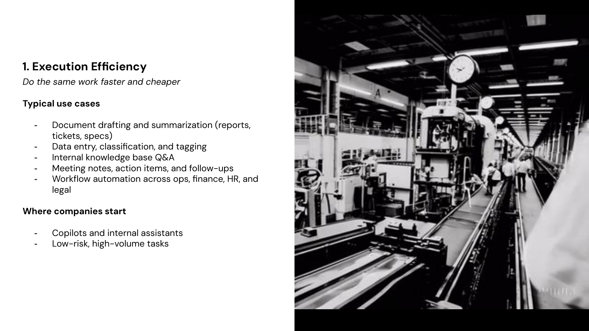
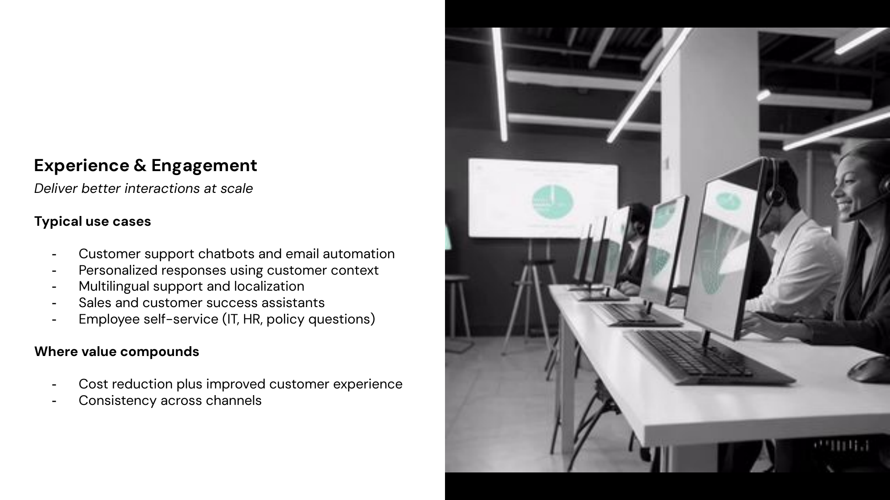
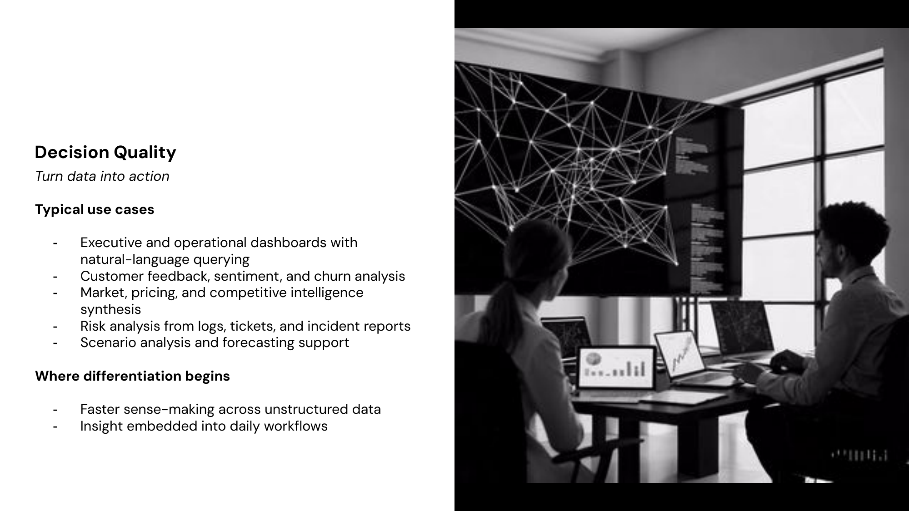
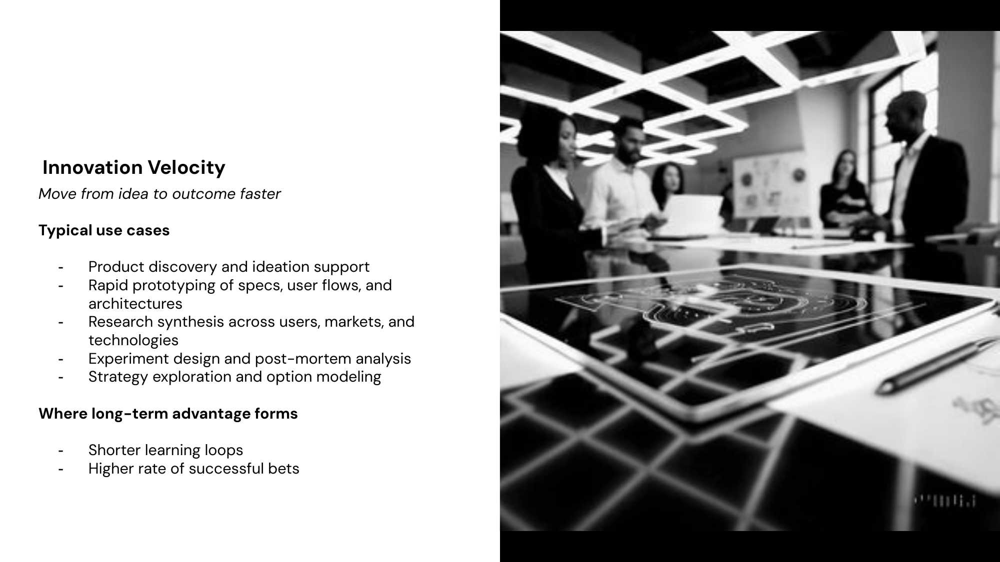
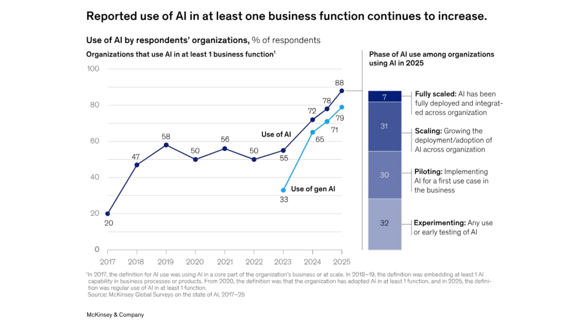

# Why LLMs Matter in Business

A $37 billion market — and growing 3x annually

---

## The $37 Billion Landscape

Enterprise GenAI spending **tripled year-over-year** to $37B in 2025 — the fastest-growing software category in history.

- **$19B** went to applications (51%), **$18B** to infrastructure
- AI applications now represent **6% of the entire global SaaS market**
- At least **10 products generate >$1B ARR**; 50+ exceed $100M ARR
- **88%** of organizations use AI in at least one function
- **76%** of enterprise AI use cases are now purchased (not built), up from 53% a year ago

> AI deal conversion rates hit 47% — nearly double traditional SaaS.

*Source: Menlo Ventures, Jan 2026*

---

## The Four Value Pools

| Category | Spend | Growth |
|----------|-------|--------|
| **Coding & developer tools** | $7.3B | 55% of all departmental AI |
| **Horizontal AI copilots** | $8.4B | Up 5.3x YoY |
| **Vertical AI** (healthcare, legal, finance) | $3.5B | Nearly 3x YoY |
| **IT operations** | $700M | Fastest wins |

Startups captured **63% of AI application revenue** — earning $2 for every $1 incumbents earned.

*Sources: Menlo Ventures, Jan 2026; McKinsey, Nov 2025*

---

## 1. Execution Efficiency

---

## 2. Experience & Engagement

---

## 3. Decision Quality

---

## 4. Innovation Velocity

---

## The Strategic Shift

---

## AI Adoption is Accelerating

*Source: McKinsey, Nov 2025; BCG, Oct 2025*
