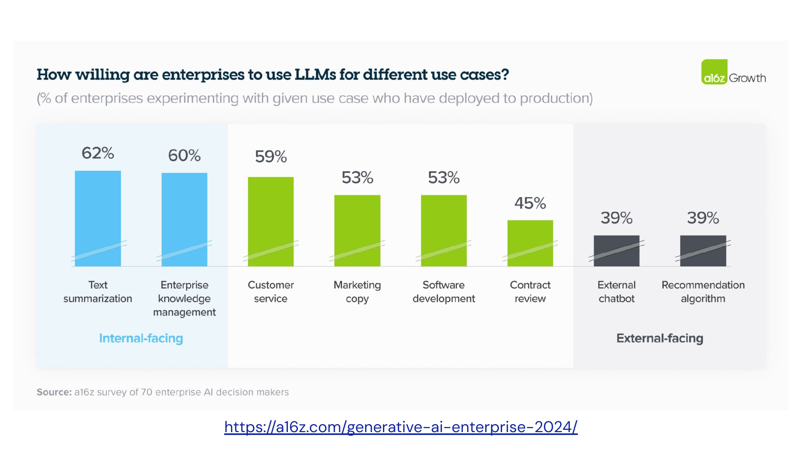
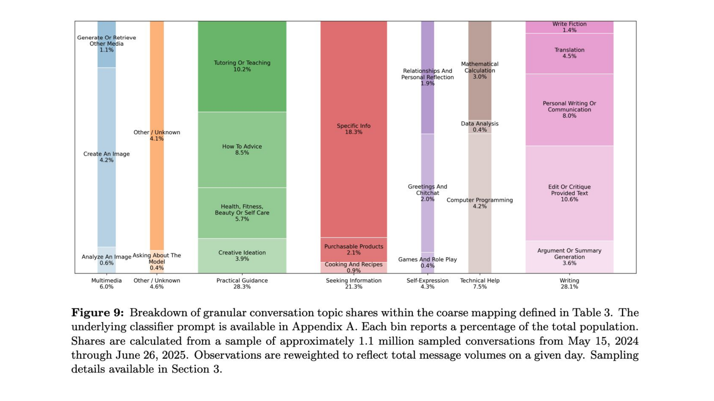

# Core Business Use Cases

Where the money actually goes

---

## Enterprise LLM Adoption

**[Generative AI Enterprise 2024 — a16z](https://a16z.com/generative-ai-enterprise-2024/)**

---

## Coding — AI's First Killer App ($4B)

AI-assisted coding is the first GenAI category to reach massive commercial scale.

- **$4.0B** in coding AI spend — 55% of all departmental AI investment
- **50%** of developers now use AI coding tools daily
- Startups capture **71%** of coding AI spend
- The market is evolving: code completion → code agents → AI app builders
- AI coding tools process over **1 billion accepted lines of code per day**

> Coding succeeded first because feedback loops are tight — you write code, test it, and know immediately if it works.

---

## The Players: Copilot vs. Cursor vs. Claude Code

| Product | Revenue / Scale | Key Metric |
|---------|----------------|------------|
| **GitHub Copilot** | ~$2B ARR, 20M+ users | 90% of Fortune 100, 42% market share |
| **Cursor** | $1B+ ARR (from $1M in ~24 months) | $29.3B valuation, 50%+ Fortune 500 |
| **Claude Code** | ~$2.5B run-rate | 54% coding model market share, 4% of all GitHub commits |

- Cursor scaled to $200M before hiring a single enterprise sales rep
- GitHub Copilot is now a larger business than all of GitHub was when Microsoft acquired it for $7.5B
- OpenAI acquired Windsurf (Codeium) for ~$3B after failing to acquire Cursor

---

## What Coding Tools Actually Change

**Phase 1** (early): Line-level code completion — faster typing

**Phase 2** (mid): Context-aware generation — whole-function, multi-file

**Phase 3** (now): Agentic coding — tools plan, execute, test, and iterate across repositories autonomously

- Cursor 2.0: multi-agent interface running up to **8 parallel agents** via git worktrees
- Copilot contributes **46% of all code** for active users
- Developers report "cognitive incompleteness" without it — it's a workflow dependency, not a feature

---

## Customer Service ($630M) — The Klarna Story

**Klarna's aggressive AI replacement** became 2025's most visible cautionary tale.

- AI handled ~2/3 of all chats, claiming work equivalent to 700+ agents
- Customer satisfaction fell sharply; complaints about generic, repetitive responses
- CEO admitted: **"cost was a too predominant evaluation factor"**
- Pivoted to hybrid: AI handles routine inquiries; humans handle nuance and escalations
- Went public at $19.65B valuation after the correction

> **86% of customers** prioritize empathy over speed for complex issues.

---

## The Klarna Lesson

The companies gaining ground aren't asking *"Can AI do the job?"* — they're asking *"What can people accomplish if AI handles the operational noise?"*

- **Augmentation outperforms replacement** in every documented case at scale
- Klarna pattern repeated at McDonald's (AI drive-thru errors), Dukaan (90% staff replaced, backlash)
- AI productivity gains strongest among less-experienced agents — **AI acts as a skill equalizer**
- Julie Geller, Info-Tech: *"Automate the routine to drive efficiency, but always ensure customers have a clear, easy path to a human"*

---

## Healthcare — Vertical AI's Biggest Bet ($1.4B)

Healthcare adopts AI at **2.2x the rate** of the broader economy.

- **$1.4B** in spending, nearly 3x YoY — largest vertical by far
- **85%** of healthcare AI spend flows to startups, not incumbents like Epic or Oracle Health
- **Ambient clinical documentation**: $600M — the largest subcategory
- **Coding and billing automation**: $450M — recovering lost revenue
- Patient engagement growing **20x YoY**; prior authorization growing **10x YoY**
- 8 in 10 physicians cite paperwork as a top cause of burnout

> "The hard problems aren't model problems anymore. They're product and workflow problems." — Menlo Ventures

---

## Marketing ($660M) and Financial Services

### Marketing
- Most commonly reported GenAI function alongside IT (McKinsey)
- Michaels Stores: email personalization from 20% → 95%, yielding **41% lift** in SMS click-through
- Croud (650 people): **4–5x productivity** on repeatable tasks
- Mattel: **4x more** Hot Wheels concept images

### Financial Services
- **81%** planning IT budget increases (BCG) — leads enterprise AI budget expansion
- Goldman Sachs: internal GenAI assistant for email proofing, document summarization, code translation
- Aditya Birla Capital: **20% productivity boost**, 40%+ operating cost reduction

---

## What People Actually Use LLMs For

