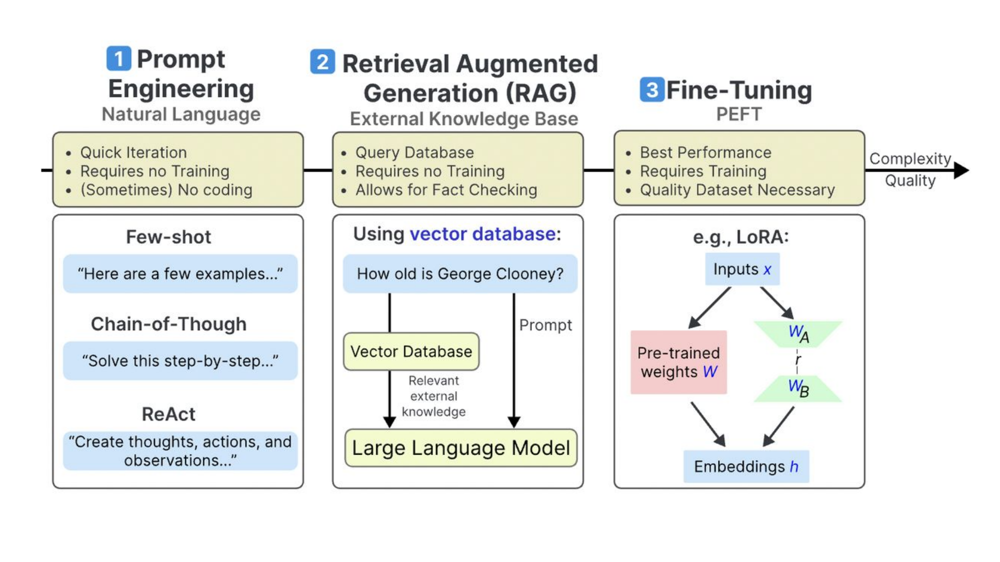

# Beyond Prompts

Prompt Engineering vs. RAG vs. Fine-Tuning vs. Agents

---

## Three Core Approaches

---

## Comparison Table

| Aspect | Prompt Engineering | RAG | Fine-Tuning |
|--------|-------------------|-----|-------------|
| **Primary Purpose** | Optimize model behavior through input design | Access external knowledge | Specialize model for specific tasks/domains |
| **Cost** | Low (mainly API costs) | Medium (infrastructure + API calls) | High (compute + storage) |
| **Setup Complexity** | Low (prompt design only) | Medium (vector DB, retrieval pipeline) | High (training infrastructure) |
| **Time to Deploy** | Minutes to hours | Days to weeks | Weeks to months |
| **Knowledge Updates** | Immediate (change prompts) | Real-time (update knowledge base) | Requires retraining |
| **Customization Level** | Low to Medium | Medium (retrieval + generation) | High (model weights) |
| **Performance Consistency** | Variable (depends on prompt) | Variable (depends on retrieval) | High (trained behavior) |
| **Data Requirements** | None to few examples | External knowledge base | Large labeled datasets |
| **Best Use Cases** | General optimization, quick iterations | Q&A, knowledge-intensive tasks | Domain specialization, consistent style |
| **Hallucination Risk** | Medium | Low (grounded in sources) | Low (trained on data) |

---

## The Fourth Approach: Agentic Architectures

Beyond single-turn prompts, the industry is moving to **multi-step agent systems**:

- **Tool Use / Function Calling** — LLMs invoke external APIs, databases, and code interpreters
- **Multi-Agent Systems** — Orchestrate multiple specialized agents working in parallel
- **Open Standards** — Universal protocols (MCP, AGENTS.md) for connecting models to tools and data

> More on agents and open standards in the **Emerging Trends** section.
