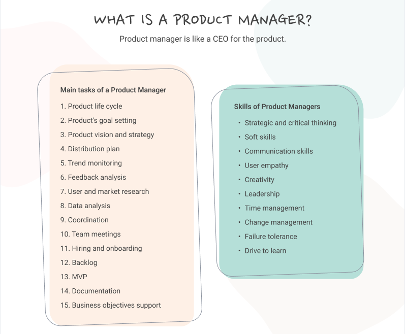

---

# What is Product Management?

If you're here, you probably already have some PM experience. So let's skip the "PMs are the CEO of the product" cliché and get into what product management actually looks like when you're doing it well, and at scale.

---

## Definition & Core Purpose

At its core, product management is about **maximizing the value a product creates**: for users, for the business, and ideally for the broader ecosystem.

But that simple definition hides enormous complexity.

---

> PMs exist because building products requires making thousands of decisions, and someone needs to own the coherence of those decisions over time.

---

Engineering decides *how* to build. Design decides *what it looks like and feels like*. Business decides *what we can afford and sell*.

Product management sits at the intersection, ensuring all of these decisions ladder up to something that actually matters.

---

## The Three Lenses

Every good PM decision balances three perspectives:

1. **User Value**: Does this solve a real problem? Will people actually use it?
2. **Business Value**: Does this move metrics that matter? Can we capture value from it?
3. **Feasibility**: Can we actually build this? What are the trade-offs?

The best PMs don't just balance these. They find solutions that score high on all three. That's the craft.

---

## What PMs Don't Do
*(But People Think They Do)*

- **PMs don't manage people** (usually). Your "team" doesn't report to you.
- **PMs don't have authority.** You can't tell engineering what to do.
- **PMs don't make all the decisions.** You facilitate decisions and break ties.
- **PMs don't need to be technical geniuses or design experts.** But you need to speak both languages fluently.

---

> The job is influence, not control. That's what makes it hard.

---

## The PM Role Across Company Stages

The same title means wildly different things depending on where you work.

---

### Early-Stage Startup (10-50 people)

At this stage, "PM" might not even be a formal role. Founders often play the PM function, or one generalist does everything.

**What PM looks like here:**
- You're doing customer support to understand users
- You might write code, design mockups, or run sales calls
- Strategy is "what do we build this week to not die"
- Shipping speed matters more than process

---

### Early-Stage Startup

**The upside:** Enormous impact, learning, and ownership.

**The downside:** No mentorship, no infrastructure, high chaos.

---

### Growth-Stage (50-500 people)

This is where PM becomes a real discipline. You have enough users that intuition alone won't cut it.

**What PM looks like here:**
- Formal product teams start emerging
- You're balancing scaling what works vs. finding new growth
- Data infrastructure is getting built, and you need to use it
- Cross-functional complexity increases dramatically

---

### Growth-Stage

**The upside:** Shape the product culture, still have significant impact.

**The downside:** Growing pains everywhere, processes that don't scale.

---

### Enterprise (500+ people)

PM at scale looks completely different. You're one of many PMs, and coordination becomes a primary job function.

**What PM looks like here:**
- You own a slice of a much larger product
- Stakeholder management is 40%+ of your job
- Strategy happens at multiple levels (your area, org, company)
- Impact comes through influence across many teams

---

### Enterprise

**The upside:** Resources, mentorship, complex problems.

**The downside:** Slower pace, more politics, narrower scope.

---

## The Stage-Mismatch Problem

One of the most common PM career mistakes is not recognizing that skills don't fully transfer across stages.

A brilliant startup PM might flounder at Google. A polished enterprise PM might struggle at a Series A company.

**Self-awareness question:** What stage are you actually good at? What stage do you enjoy?

---

## Product Management vs Adjacent Roles

The org chart is getting crowded. Here's how PM differs from roles that seem similar.

---

### PM vs Product Marketing Manager (PMM)

**PM:** What we build and why

**PMM:** How we position, message, and bring it to market

The handoff point varies by company. The key distinction: PMs own the product, PMMs own the narrative.

---

### PM vs Technical Program Manager (TPM)

**PM:** What and why

**TPM:** How we coordinate complex execution across teams

TPMs are execution specialists. They don't decide what to build, but they're essential for *how* it gets built when multiple teams are involved.

---

### PM vs Engineering Manager (EM)

**PM:** What we build, why, and whether it's working

**EM:** Who builds it, how they grow, and how the team operates

The PM/EM relationship is one of the most important partnerships. You're co-leading the team without either having full authority.

---

### PM vs Designer

**Designer:** What the experience looks and feels like, how users interact with it

**PM:** Whether the experience solves the right problem and achieves business goals

Overlap: Both should understand users deeply. Both should care about the full experience.

---

## Core Competencies Framework

What do you actually need to be good at? Here's a framework that goes beyond buzzwords.

---

### Strategic Thinking

- **Vision Translation:** Taking company strategy and translating it to product opportunity
- **Problem Selection:** Knowing which problems are worth solving (and which aren't)
- **Trade-off Clarity:** Articulating what you're *not* doing and why
- **Long-term/Short-term Balance:** Shipping now while investing in the future

---

### Execution Excellence

- **Scope Management:** Defining what "done" looks like and keeping it tight
- **Risk Identification:** Seeing what could go wrong before it does
- **Decision Velocity:** Making calls with incomplete information
- **Quality Bar Calibration:** Knowing when good enough is good enough

---

### Influence & Communication

- **Stakeholder Mapping:** Knowing who cares about what and why
- **Narrative Building:** Creating compelling stories around your product direction
- **Difficult Conversations:** Saying no, giving hard feedback, managing conflict
- **Cross-functional Trust:** Building relationships that survive disagreement

---

## Types of Product Managers

PM isn't one job. It's a family of related roles. Here are the major subspecies.

---

### Growth PM

**Focus:** Acquisition, activation, retention, monetization

**Day-to-day:** Running experiments, analyzing funnels, optimizing flows

**Good fit if:** You love data, can handle lots of small failures, and get energy from optimization.

---

### Platform PM

**Focus:** Internal tools, APIs, infrastructure that other teams build on

**Day-to-day:** Understanding developer needs, managing technical complexity, thinking in abstractions

**Good fit if:** You're more technical than average, enjoy infrastructure problems, can handle less visible impact.

---

### AI/ML PM

**Focus:** Products powered by machine learning and AI capabilities

**Day-to-day:** Working with data scientists, managing model uncertainty, designing for probabilistic outputs

The fundamental difference: traditional products are deterministic (same input → same output). AI products are probabilistic. That changes everything about how you PM.

---

### B2B vs B2C

**B2B PM:**
- Longer sales cycles, fewer customers, higher revenue per customer
- Sales team heavily influences roadmap
- User ≠ buyer ≠ decision-maker

**B2C PM:**
- Millions of users, lower revenue per user
- Product-led growth, viral mechanics
- User = buyer (usually)

---

## What Makes Great PMs Stand Out

After working with hundreds of PMs, here are the patterns that separate good from great.

---

### They Have Taste

Hard to define, but you know it when you see it. Great PMs have strong opinions about what good looks like. Good UX, good strategy, good code.

**How to develop taste:** Use lots of products critically. Ask "why" about everything. Study both successes and failures.

---

### They're Intellectually Honest

They change their minds when evidence warrants it. They admit when they're wrong. They don't fall in love with their own ideas.

**The test:** When's the last time you killed your own project?

---

### They Communicate with Precision

They say what they mean. They're clear about certainty vs. speculation. They adjust communication style for the audience.

**The bar:** After you explain something, does the other person actually understand?

---

### They Build Trust Through Follow-Through

They do what they say they'll do. They close loops. They remember the small commitments.

> Great PMs are known for "if they said it'll happen, it'll happen."

---

### They Create Clarity from Chaos

The most valuable PM skill.

When things are confusing, they structure the problem. When there's conflict, they identify the actual disagreement. When there are too many options, they create a framework for choosing.

---

### They Focus

Maybe the most underrated skill.

Great PMs say no constantly. They're not trying to do everything. They're trying to do the right things extremely well.

**The discipline:** What are you *not* working on? Why?

---

## Wrapping Up

Product management is a craft that takes years to master, and the terrain keeps changing.

The fundamentals (user value, business value, execution, influence) stay constant. But how you apply them depends entirely on context.

---

The best PMs are learning machines. They reflect on what worked and didn't. They seek feedback actively. They study other PMs and adjacent functions.

You're already on this path. Now let's talk about how AI is changing all of it.
