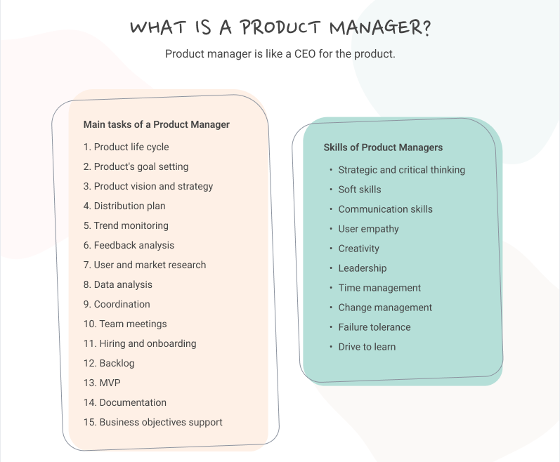

---

# What is Product Management?

If you're here, you probably already have some PM experience.

So let's skip the "PMs are the CEO of the product" cliché and get into what product management actually looks like when you're doing it well, and at scale.

---

## Core Purpose

Product management is about **maximizing the value a product creates**: for users, for the business, and ideally for the broader ecosystem.

PMs exist because building products requires making thousands of decisions, and someone needs to own the coherence of those decisions over time.

---

## The Intersection

Engineering decides *how* to build. Design decides *what it looks like and feels like*. Business decides *what we can afford and sell*.

Product management sits at the intersection, ensuring all of these decisions ladder up to something that actually matters.

---

## The Three Lenses

Every good PM decision balances three perspectives:

1. **User Value:** Does this solve a real problem? Will people actually use it?
2. **Business Value:** Does this move metrics that matter? Can we capture value from it?
3. **Feasibility:** Can we actually build this? What are the trade-offs?

The best PMs don't just balance these. They find solutions that score high on all three. That's the craft.

---

## What PMs Don't Do
*(But People Think They Do)*

- **PMs don't manage people** (usually). Your "team" doesn't report to you.
- **PMs don't have authority.** You can't tell engineering what to do.
- **PMs don't make all the decisions.** You facilitate decisions and break ties.
- **PMs don't need to be technical geniuses or design experts.** But you need to speak both languages fluently.

> The job is influence, not control. That's what makes it hard.

---

## The PM Role Across Company Stages

The same title means wildly different things depending on where you work.

A brilliant startup PM might flounder at Google. A polished enterprise PM might struggle at a Series A company.

**Self-awareness question:** What stage are you actually good at? What stage do you enjoy?

---

### Early-Stage Startup

At this stage, "PM" might not even be a formal role. Founders often play the PM function, or one generalist does everything.

**What PM looks like:**
- Customer support, sales calls, research, prioritization
- Writing quick specs, maybe making mockups or prototypes
- Strategy is "what do we build this week to not die"
- Shipping speed matters more than process

**Upside:** Enormous impact, learning, ownership.

**Downside:** No mentorship, weak infrastructure, high chaos.

---

### Growth-Stage

This is where PM becomes a real discipline. You have enough users that intuition alone won't cut it.

**What PM looks like:**
- Formal product teams start emerging
- You're balancing scaling what works vs. finding new growth
- Data infrastructure is getting built, and you need to use it
- Cross-functional complexity increases dramatically

**Upside:** Shape the product culture, still have significant impact.

**Downside:** Growing pains everywhere, processes that don't scale.

---

### Enterprise

PM at scale looks completely different. You're one of many PMs, and coordination becomes a primary job function.

**What PM looks like:**
- You own a slice of a much larger product
- Stakeholder management is 40%+ of your job
- Strategy happens at multiple levels: your area, org, company
- Impact comes through influence across many teams

**Upside:** Resources, mentorship, complex problems.

**Downside:** Slower pace, more politics, narrower scope.

---

## PM vs Adjacent Roles

The org chart is getting crowded. Here's how PM differs from roles that seem similar.

| Role | Owns |
|---|---|
| **PM** | What we build, why, and whether it works |
| **PMM** | Positioning, messaging, launch narrative |
| **TPM** | Execution coordination across teams |
| **EM** | Engineering team, delivery health, people growth |
| **Designer** | User experience, interaction, visual/system design |

Overlap is normal. Confusion is optional.

---

## Core Competencies Framework

What do you actually need to be good at?

1. **Strategic Thinking:** Choosing the right problems
2. **Execution Excellence:** Getting from idea to shipped product
3. **Influence & Communication:** Creating alignment without authority

Great PMs are strong enough across all three that teams trust their judgment.

---

### Strategic Thinking

- **Vision Translation:** Taking company strategy and translating it to product opportunity
- **Problem Selection:** Knowing which problems are worth solving, and which aren't
- **Trade-off Clarity:** Articulating what you're *not* doing and why
- **Long-term/Short-term Balance:** Shipping now while investing in the future

---

### Execution Excellence

- **Scope Management:** Defining what "done" looks like and keeping it tight
- **Risk Identification:** Seeing what could go wrong before it does
- **Decision Velocity:** Making calls with incomplete information
- **Quality Bar Calibration:** Knowing when good enough is good enough

---

### Influence & Communication

- **Stakeholder Mapping:** Knowing who cares about what and why
- **Narrative Building:** Creating compelling stories around your product direction
- **Difficult Conversations:** Saying no, giving hard feedback, managing conflict
- **Cross-functional Trust:** Building relationships that survive disagreement

---

## Types of Product Managers

PM isn't one job. It's a family of related roles.

| Type | Focus | Good fit if... |
|---|---|---|
| **Growth PM** | Acquisition, activation, retention, monetization | You love data, experiments, and optimization |
| **Platform PM** | APIs, internal tools, infrastructure | You're technical and enjoy abstraction |
| **AI/ML PM** | Probabilistic products powered by models | You can manage uncertainty and model behavior |

---

### AI/ML PM

Traditional products are deterministic:

> same input → same output

AI products are probabilistic:

> same input → possibly different outputs

That changes everything about how you PM: requirements, quality, evaluation, user trust, and launch readiness.

---

### B2B vs B2C

**B2B PM:**
- Longer sales cycles, fewer customers, higher revenue per customer
- Sales team heavily influences roadmap
- User ≠ buyer ≠ decision-maker

**B2C PM:**
- Millions of users, lower revenue per user
- Product-led growth, viral mechanics
- User = buyer, usually

---

## What Makes Great PMs Stand Out

After working with hundreds of PMs, here are the patterns that separate good from great:

- They have taste
- They're intellectually honest
- They communicate with precision
- They build trust through follow-through
- They create clarity from chaos
- They focus

---

### Taste & Judgment

Great PMs have strong opinions about what good looks like: good UX, good strategy, good code, good trade-offs.

**How to develop taste:** Use lots of products critically. Ask "why" about everything. Study both successes and failures.

Taste is not decoration.

Taste is judgment under ambiguity.

---

### Truth-Seeking

Great PMs are intellectually honest.

They change their minds when evidence warrants it. They admit when they're wrong. They don't fall in love with their own ideas.

**The test:** When's the last time you killed your own project?

---

### Trust & Communication

Great PMs say what they mean. They're clear about certainty vs. speculation. They adjust communication style for the audience.

They also follow through. They do what they say, close loops, and remember the small commitments.

> Great PMs are known for "if they said it'll happen, it'll happen."

---

### Clarity & Focus

When things are confusing, great PMs structure the problem.

When there's conflict, they identify the actual disagreement.

When there are too many options, they create a framework for choosing.

Then they focus. They say no constantly. They're not trying to do everything. They're trying to do the right things extremely well.

---

## Wrapping Up

Product management is a craft that takes years to master, and the terrain keeps changing.

The fundamentals stay constant:

- User value
- Business value
- Feasibility
- Execution
- Influence

But how you apply them depends entirely on context.

---

The best PMs are learning machines.

They reflect on what worked and didn't. They seek feedback actively. They study other PMs and adjacent functions.

You're already on this path.

Now let's talk about how AI is changing all of it.
